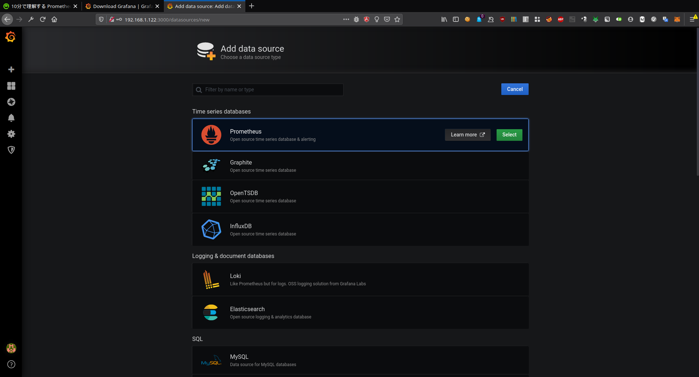

## Day 3

---

### Prometheus

- Pull型のリソース監視システム（監視対象のサーバから情報を取得）
- アラートなど設定できる

---

### Prometheusダウンロード
https://prometheus.io/download/

```
wget https://github.com/prometheus/prometheus/releases/download/v2.16.0/prometheus-2.16.0.linux-amd64.tar.gz
tar xvf prometheus-2.16.0.linux-amd64.tar.gz

./prometheus
```

---

### node exporter
- システムリソース情報をPrometheusに提供できるようになる

```
wget https://github.com/prometheus/node_exporter/releases/download/v0.18.1/node_exporter-0.18.1.linux-armv7.tar.gz
tar xvf node_exporter-0.18.1.linux-armv7.tar.gz

./node_exporter &
```

---

### Prometheusの監視に追加する
prometheus.yml

```
scrape_configs:
  - job_name: 'node_exporter'
    static_configs:
      - targets: ['localhost:9100']
```

---

### PrometheusのWebUI
process_resident_memory_bytes


---

### Grafana
- ログ・データを可視化するツール
- 複数のデータベースに対応しており、表示が可能
- OSS

---

### Grafanaダウンロード

```
wget https://dl.grafana.com/oss/release/grafana-6.7.1.linux-armv7.tar.gz
tar xvf grafana-6.7.1.linux-armv7.tar.gz
cd grafana-6.7.1/
./bin/grafana-server
```

---

### データソース設定画面へ


---

### Prometheusデータソースの追加


---

### URL書き込んで、保存し、ダッシュボードimportを選択


---

### [Grafana Dashborads](https://grafana.com/grafana/dashboards?orderBy=name&direction=asc)


---

### Ansible
- 構成管理ツール
- yamlで設定ファイルを書くことで、サーバ設定を合わせる
- 1台だろうが、1000台だろうが、コマンドひとつでkて合わせることができる
